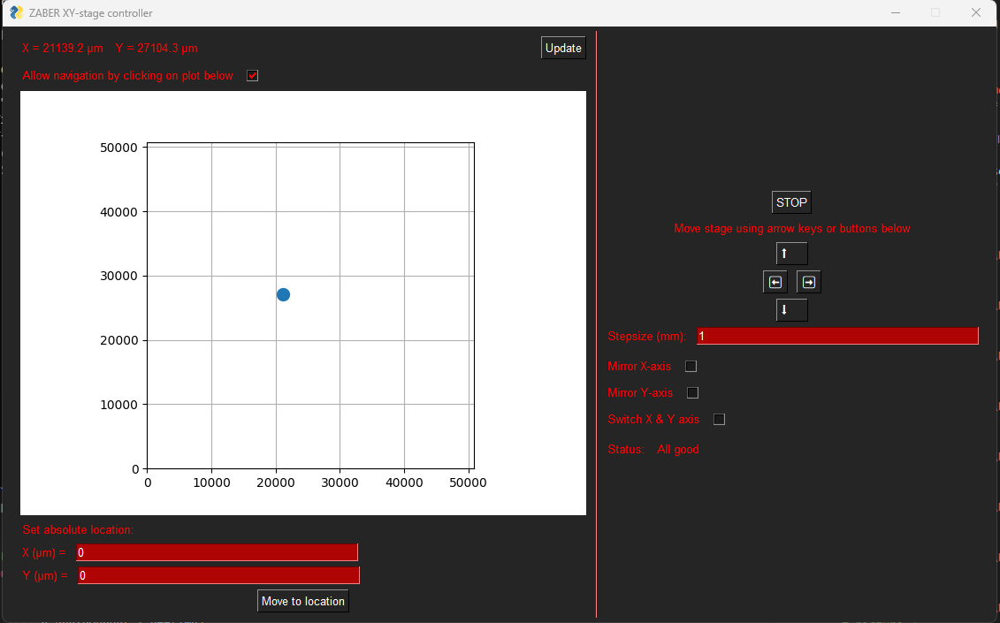

# zaberXYGUI

Extremely simple GUI to control a Zaber xy stage, consisting of two chained stages. This code is written specifically for 2 X-LSM050A stages, but it should be very easy to adapt it to other devices, if it is necessary to adapt it at all.

This controller script should be pretty platform independent - I use it on Windows and Linux, but iOS should also just work.

## Screenshot

## How to use

This is not a complicated program. The screenshot above should really tell you everything you need. Press the buttons and see what happens.

## Install

1. Make sure you have a Python environment installed with the prerequisites - or install them using poetry, if you know what that is. Prerequisites can be found in the `pyproject.toml` file.
2. Run `main.py` from the terminal.
3. It should just work™!

If anything is unclear, feel free to contact me/open an issue.
